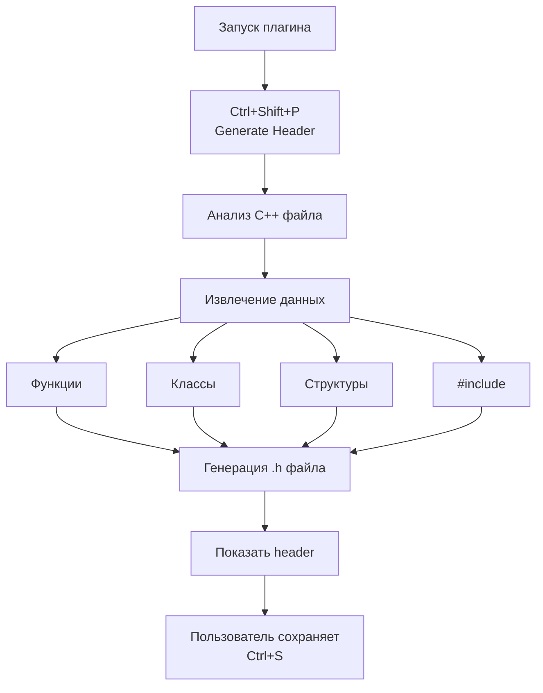

# C++ Header Generator - Лабораторная работа 3

## Описание
**Финогенов Никита 505371** \
**М3102**

Плгин для VS Code, который анализирует `c` и `cpp` код и автоматически генерирует заголовочные файлы `h`. **В плагине не реализовано считывание методов и глобальных констант.** 

## Функционал
- Анализ **функций**, **классов**, **структур**
- Извлечение **#include**
- Создание **forward declarations** для классов

## Установка и использование
1. Клонировать репозиторий
2. Открыть папку в **VS Code**
3. Нажать **F5** для запуска
4. Открыть `cpp` файл
5. **Ctrl+Shift+P**
6. Выполнить команду "**Generate C++ Header from Code**"

## Архитектура

## Пример работы
**Исходный файл (example.cpp):**
```cpp
#include <iostream>
#include <vector>

class MyClass {
public:
    void calculate(int x);
};

struct Point {
    int x, y;
};

int addition(int a, int b) {
    return a + b;
}
```
**Результат работы (example.h)**
```h
// Generated header file from lab1.cpp
// Generated by C++ Header Generator

#ifndef LAB1_H_
#define LAB1_H_

// Includes
#include <iostream>
#include <vector>

// Forward declarations
class MyClass; 

// Structures
struct Point;

// Function declarations
int addition(int a, int b);

#endif // LAB1_H_
```